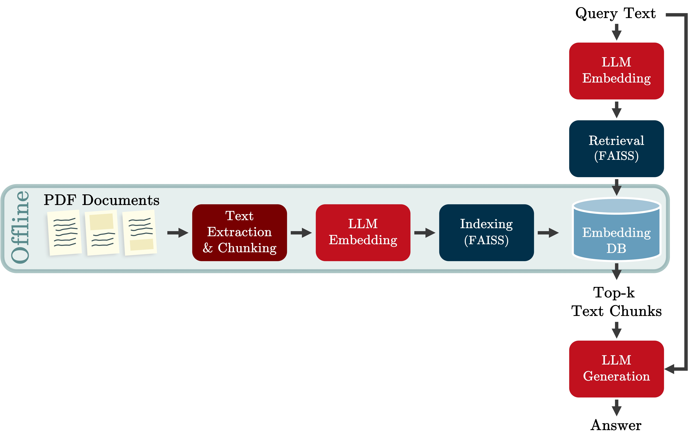

  <h1 align="center">Retrieval-Augmented Generation with PDF files and OCR</h1>

    
    
<em>Fig. 1: Scheme of our RAG pipeline.</em>

### Introduction

**Retrieval-Augmented Generation** (RAG) combines Large Language Models (LLMs) with information retrieval to produce more accurate and fact-based answers. The key idea behind RAG is to enhance the prompt to the LLM with relevant information retrieved from a pre-computed collection of documents. This allows the model to generate answers based on a broader context, making the responses more grounded and precise.

Our RAG pipeline, illustrated in _Fig. 1_, is designed to extract information from PDF files, including text from images using Optical Character Recognition (OCR).  In addition, it also returns the document name and page number as references.

The pipeline is divided into two stages:

##### **Offline Stage:**
1. **Text Extraction:** We extract text and images from PDFs using **PyMuPDF (Fitz)** [1] and apply **pytesseract** [2] to extract text from images.
2. **Text Chunking:** The extracted text is broken into chunks to improve retrieval performance.
3. **Embedding Creation:** Each chunk is converted into a vector (embedding) using **Llama 3.2** [3, 4].
4. **Indexing and Storage:** These embeddings are indexed using **FAISS** [5, 6] and stored in a database for fast retrieval.

##### **Online Stage:**
1. **Query Processing:** When a query text is provided, we extract the query’s embedding.
2. **Retrieval:** We search the top-k most similar embeddings to the query’s embedding in the database.
3. **Answer Generation:** The query, along with the relevant context (the text from the top-k matching embeddings), is fed into the LLM, which generates the answer.

By combining retrieval with generation, our RAG system reduces the risk of inaccurate or irrelevant content ("hallucinations"). It also increases transparency by providing references to the documents that informed the response, allowing users to check the resources for themselves.

### Install
1. Clone our repository.

2. Install Google tesseract by running `apt-get install -y tesseract-ocr`.

3. Install required libraries by running `pip install -r requirements.txt`.

4. Install our package in editable mode by running:
`pip3 install -e .` from the root folder.

5. Create `.env` file in the root folder and add the Hugging Face token. Example `HF_TOKEN="123456abcd"`.

### Usage
The Jupyter notebook `demo.ipynb` provides a detailed demonstration of the functionality of three core components we developed:

- **PDFProcessor:** This module, built using PyMuPDF, is designed for comprehensive PDF processing. It extracts text content and uses Optical Character Recognition (OCR) via pytesseract to retrieve information from images embedded within PDFs.

- **LargeLanguageModel:** Powered by Llama 3.2 (Meta), this wrapper simplifies the encoding and text generation processes of the language model, enhancing usability.

- **IndexManager:** This module is responsible for creating, managing, and querying a FAISS index, which enables efficient similarity searches among the embedding vectors in the dataset. It also maintains a mapping between text chunks and their corresponding PDF filenames and page numbers, ensuring seamless integration of the final LLM-generated answers with their contextual references.

These components leverage state-of-the-art technologies and are designed to work cohesively, enabling a seamless workflow for extracting textual and visual data from PDFs while leveraging LLMs and efficient retrieval using FAISS indexing.

### References:
[1] PyMuPDF. "Documentation: The basics". https://pymupdf.readthedocs.io/en/latest/the-basics.html

[2] "Python Tesseract". https://github.com/h/pytesseract

[3] Meta. "Introducing to Llama 3.2". https://www.llama.com

[4] Hugging Face. "meta-llama/Llama-3.2-3B-Instruct". https://huggingface.co/meta-llama/Llama-3.2-3B-Instruct

[5] Douze, Matthijs, et al. "The Faiss Library". https://arxiv.org/abs/2401.08281

[6] FacebookResearh. "Faiss". https://github.com/facebookresearch/faiss
